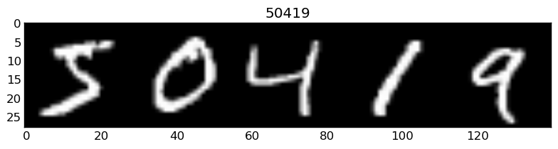

# arctic-captions

Welcome to a fork of the source code for [Show, Attend and Tell: Neural Image Caption Generation with Visual Attention](http://arxiv.org/abs/1502.03044). I am trying to use Visual Attention to build a model that translates math equations to latex code (see more background on the [research challenge proposed by OpenAI](https://openai.com/requests-for-research/#im2latex)).

## MNIST digits appended together as a toy dataset
A toy dataset is always a great place to start.  Our first change was adding support in the visual attention model to train on image-caption pairs like this:

Things to keep in mind, to keep our code general for the im2latex task at hand
- latex is not like words in sentences to parse.  The absence of a nice token delimiter (like a space) suggests that we should read the latex by the character level.
- pdf latex images will come in all sorts of sizes.  Choosing a generalizable way to apply a convolutional neural network to the images will be important. The Show, Attend, and Tell paper operates on Fixed Sized Center Crops, and the feature maps it attends to is size `L x D` or `(14x14) x 512`.  We can use [Spatial Pyramid Pooling](https://arxiv.org/pdf/1406.4729.pdf) to turn variable size images into fixed size feature maps.  After reading more into Show, Attend, and Tell, the weightings `alpha_i` are generated by an attention function which is a multilayer perceptron.  Since the MLP outputs a fixed number of `alpha_i`, there is no way to learn a variable length weighting.  Hence, we indeed need solutions to get a fixed number of feature maps.
- computing image features for mnist is easy, since there is plenty of high quality convnets made with mnist.  There is less work with latex.  I suggest that we learn to use some of the unsupervised techniques, such as generative adversarial networks to learn image features for latex code.  It may be worth also trying this type of network on the mnist appended toy data, and see if the results match up with a pretrained convnet on mnist.

## Dependencies

This code is written in python. To use it you will need:

* Python 2.7
* A relatively recent version of [NumPy](http://www.numpy.org/)
* [scikit learn](http://scikit-learn.org/stable/index.html)
* [skimage](http://scikit-image.org/docs/dev/api/skimage.html)
* [argparse](https://www.google.ca/search?q=argparse&oq=argparse&aqs=chrome..69i57.1260j0j1&sourceid=chrome&es_sm=122&ie=UTF-8#q=argparse+pip)

In addition, this code is built using the powerful
[Theano](http://www.deeplearning.net/software/theano/) library. If you
encounter problems specific to Theano, please use a commit from around
February 2015 and notify the authors.

To use the evaluation script (metrics.py): see
[coco-caption](https://github.com/tylin/coco-caption) for the requirements.

## Reference

If you use this code as part of any published research, please acknowledge the
following paper (it encourages researchers who publish their code!):

**"Show, Attend and Tell: Neural Image Caption Generation with Visual Attention."**  
Kelvin Xu, Jimmy Ba, Ryan Kiros, Kyunghyun Cho, Aaron Courville, Ruslan
Salakhutdinov, Richard Zemel, Yoshua Bengio. *To appear ICML (2015)*

    @article{Xu2015show,
        title={Show, Attend and Tell: Neural Image Caption Generation with Visual Attention},
        author={Xu, Kelvin and Ba, Jimmy and Kiros, Ryan and Cho, Kyunghyun and Courville, Aaron and Salakhutdinov, Ruslan and Zemel, Richard and Bengio, Yoshua},
        journal={arXiv preprint arXiv:1502.03044},
        year={2015}
    } 

## License

The code is released under a [revised (3-clause) BSD License](http://directory.fsf.org/wiki/License:BSD_3Clause).
